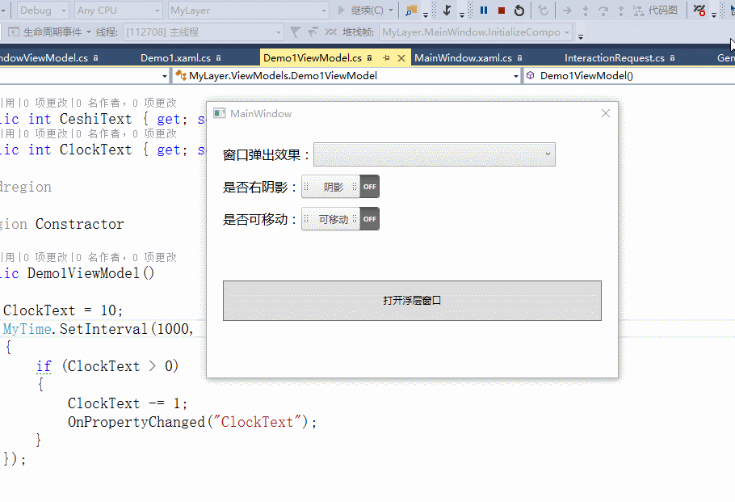

# 向大家分享在项目中编写的比较实用的控件：MyLayer，弹窗控件
### lib文件夹中放的是控件的源码dll，该dll包含大量本人在这几年项目中的控件，现在逐步编写到github上，[github地址](https://github.com/y19890902q/MyWPFUI.git)，感谢ay的支持
我在源代码的基础上进行了深度的改造，让使用者更加方便，功能更加强大。源码我都加了注释。
## MyLayerServices的ShowDialog方法满足不同的需求。
```C#

        /// <summary>
        /// 弹出窗口
        /// </summary>
        /// <param name="title">窗口的title</param>
        /// <param name="view">窗口的内容</param>
        /// <param name="request">InteractionRequest类，调用者可执行Requested，即可关闭弹出的窗口</param>
        public static void ShowDialog(string title, System.Windows.Controls.UserControl view, InteractionRequest request)
        {
            ShowDialog<object>(null, title, view, null, null, null, null, request);
        }
        /// <summary>
        /// 弹出窗口
        /// </summary>
        /// <typeparam name="TViewModel">传入的viewmodel</typeparam>
        /// <param name="title">窗口的title</param>
        /// <param name="view">窗口的内容</param>
        /// <param name="viewmodel">窗口的内容的viewmodel</param>
        /// <param name="winLoadAction">窗口加载完页面后执行的操作</param>
        /// <param name="request">InteractionRequest类，调用者可执行Requested，即可关闭弹出的窗口</param>
        public static void ShowDialog<TViewModel>(string title, System.Windows.Controls.UserControl view, TViewModel viewmodel, Action winLoadAction, InteractionRequest request)
        {
            ShowDialog<TViewModel>(null, title, view, viewmodel, null, null, winLoadAction, request);
        }
        /// <summary>
        /// 弹出窗口
        /// </summary>
        /// <typeparam name="TViewModel">传入的viewmodel</typeparam>
        /// <param name="title">窗口的title</param>
        /// <param name="view">窗口的内容</param>
        /// <param name="viewmodel">窗口的内容的viewmodel</param>
        /// <param name="onDialogCloseCallBack">窗口关闭后的回掉事件</param>
        /// <param name="option">窗口的一些属性设置（主要是动画）</param>
        /// <param name="winLoadAction">窗口加载完页面后执行的操作</param>
        /// <param name="request">InteractionRequest类，调用者可执行Requested，即可关闭弹出的窗口</param>
        public static void ShowDialog<TViewModel>(string title, System.Windows.Controls.UserControl view, TViewModel viewmodel, Action<TViewModel> onDialogCloseCallBack, MyLayerOptions option, Action winLoadAction, InteractionRequest request)
        {
            ShowDialog<TViewModel>(null, title, view, viewmodel, onDialogCloseCallBack, option, winLoadAction, request);
        }
        /// <summary>
        /// 弹出窗口
        /// </summary>
        /// <typeparam name="TViewModel">传入的viewmodel</typeparam>
        /// <param name="owner">owner</param>
        /// <param name="title">窗口的title</param>
        /// <param name="view">窗口的内容</param>
        /// <param name="viewmodel">窗口的内容的viewmodel</param>
        /// <param name="onDialogCloseCallBack">窗口关闭后的回掉事件</param>
        /// <param name="option">窗口的一些属性设置（主要是动画）</param>
        /// <param name="winLoadAction">窗口加载完页面后执行的操作</param>
        /// <param name="request">InteractionRequest类，调用者可执行Requested，即可关闭弹出的窗口</param>
        public static void ShowDialog<TViewModel>(Window owner, string title, System.Windows.Controls.UserControl view, TViewModel viewmodel, Action<TViewModel> onDialogCloseCallBack, MyLayerOptions option, Action winLoadAction, InteractionRequest request)
        {
            view.DataContext = viewmodel;
            MyLayer messageBox = new MyLayer(owner, view, title, option, true, winLoadAction);
            if (onDialogCloseCallBack != null)
            {
                messageBox.Closed += (sender, e) => onDialogCloseCallBack(viewmodel);
            }
            if (request != null)
            {
                CallParameterizedMethodAction action = new CallParameterizedMethodAction();
                action.MethodName = "Close";
                action.TargetObject = messageBox;
                InteractionRequestTrigger trigger = new InteractionRequestTrigger();
                trigger.Actions.Add(action);
                trigger.SourceObject = request;
                Interaction.GetTriggers(messageBox).Add(trigger);
            }
            messageBox.Show();
        }     

```
## MyLayerOptions是对窗口的一些属性进行设置
* MaskBrush（蒙层背景）
* CanDrag（是否可移动）
* HasShadow（是否有阴影）
* AnimationType（动画类型）

# 演示


